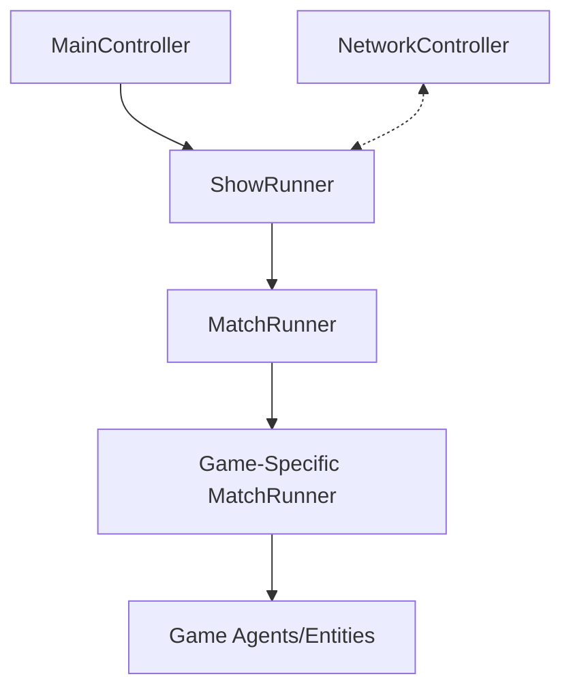
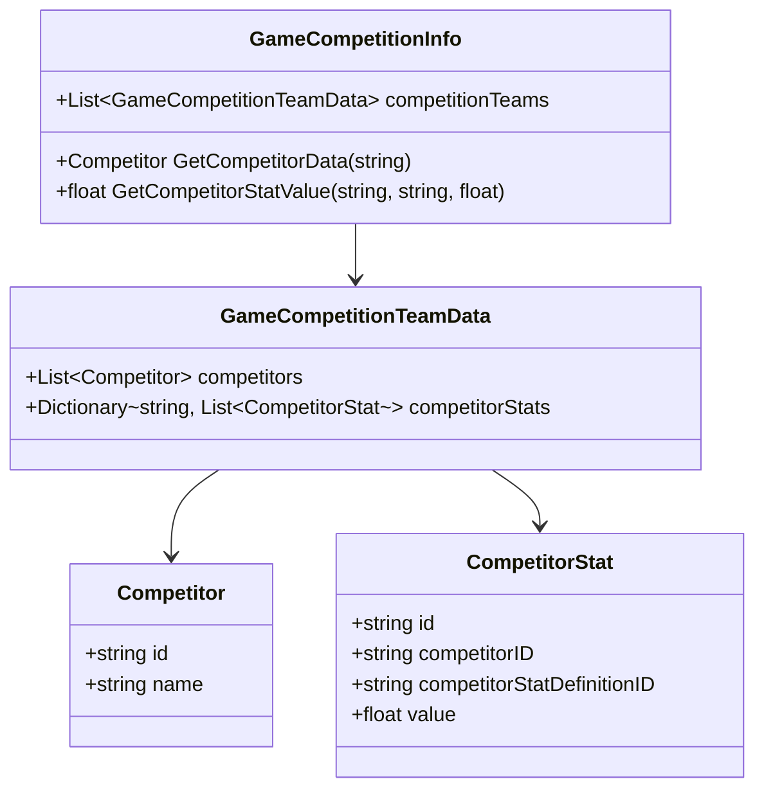

# NET-SLUM Project Summary

## Project Overview

NET-SLUM is a Unity-based gaming platform that appears to be designed for competitive games with betting functionality. The project supports multiple game types within a unified framework, with a focus on competition between AI agents or characters.

## Core Architecture

### Namespace Structure

The project follows a namespace structure primarily using `bet_slum` as the root namespace, with sub-namespaces for specific game types (e.g., `bet_slum.CombatArena`).

### Main Components



#### MainController

The `MainController` is the entry point and primary controller for the application. It:
- Initializes the application
- Determines whether to use a live or mock connection
- Sets the initial game type (CombatArena, MapGame, or Slapfight)
- Creates and manages the ShowRunner

#### ShowRunner

The `ShowRunner` (with concrete implementations `LiveShowRunner` and `MockShowRunner`) is responsible for:
- Managing the overall flow of gameplay
- Controlling betting periods
- Loading games
- Transitioning between different game states
- Communicating with backend services (in LiveShowRunner)

#### MatchRunner

The abstract `MatchRunner` class provides the framework for specific game implementations by:
- Setting up the game environment
- Initializing matches
- Managing competitors
- Handling match start/end logic

#### NetworkController

A static utility class that handles communication with external servers:
- Supports GET and POST requests
- Manages session authentication
- Uses a configurable server URL (production vs development)

## Data Structure

### Core Data Classes



These data structures define the core entities in the game:
- `Competitor` represents a participant in a game
- `CompetitorStat` defines statistics/attributes for competitors
- `GameCompetitionInfo` and `GameCompetitionTeamData` organize competitors into teams and matches

## Game Types

The project includes at least three different game types:

### 1. CombatArena

A combat-based game where:
- Two agents fight against each other
- Each agent has health that can be reduced through combat
- Victory is determined when one agent's health reaches zero
- UI elements display health bars for each agent

### 2. MapGame

Details about this game type are limited in the available code, but it's included as one of the selectable game types.

### 3. Slapfight

Another game type that appears to be in development, with limited available details.

## Network Communication

The project appears to communicate with an external service:
- Development server: `http://localhost:5001`
- Production server: `http://34.174.66.135:5000` 
- API endpoints are accessed via the `/api` path
- Authentication uses a session token mechanism

## Betting System

The application includes a betting system:
- Betting periods occur before match rounds
- Configurable timing for betting period duration
- Delays between betting periods and rounds
- Payout information is tracked after match completion

## Project Organization

```
NET-SLUM/
├── Scenes/
│   └── _BOOT/          # Main entry point scene
├── Scripts/
│   ├── Data/           # Data structures
│   ├── ShowRunner/     # Game flow management
│   └── UI/             # User interface components
├── Games/
│   ├── CombatArena/    # Combat game implementation
│   ├── MapGame/        # Map-based game
│   └── Slapfight/      # Slapfight game
└── Packages/           # Dependencies
```

## External Dependencies

The project appears to have external dependencies managed through:
- NuGet package manager (packages.config)
- Unity packages

There's a comment in the `Competitor.cs` file mentioning "sync w/ bet-slum-shared lib", suggesting integration with an external shared library.

## Development Notes

- The project appears to be designed with both live (networked) and mock (local) modes, likely for development and testing
- The `LiveShowRunner` is likely used for production, while `MockShowRunner` is for development/testing
- Comments suggest some code duplication with a separate server project

## Getting Started

To begin working with the project:

1. Load the `_BOOT` scene which initializes the application
2. Set the appropriate game type in the `MainController` inspector
3. Toggle `GoLive` to choose between mock (local) and live (networked) modes
4. The `MockShowRunner` can be used for local testing without connecting to external services

## Next Steps for Development

Based on code inspection, potential areas for continued development:
- Implementation/completion of additional game types (Slapfight, MapGame)
- Refinement of the betting system
- Integration with external services
- UI/UX improvements 