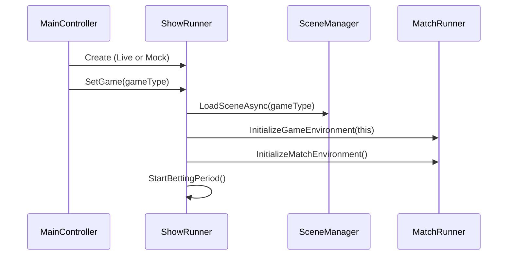
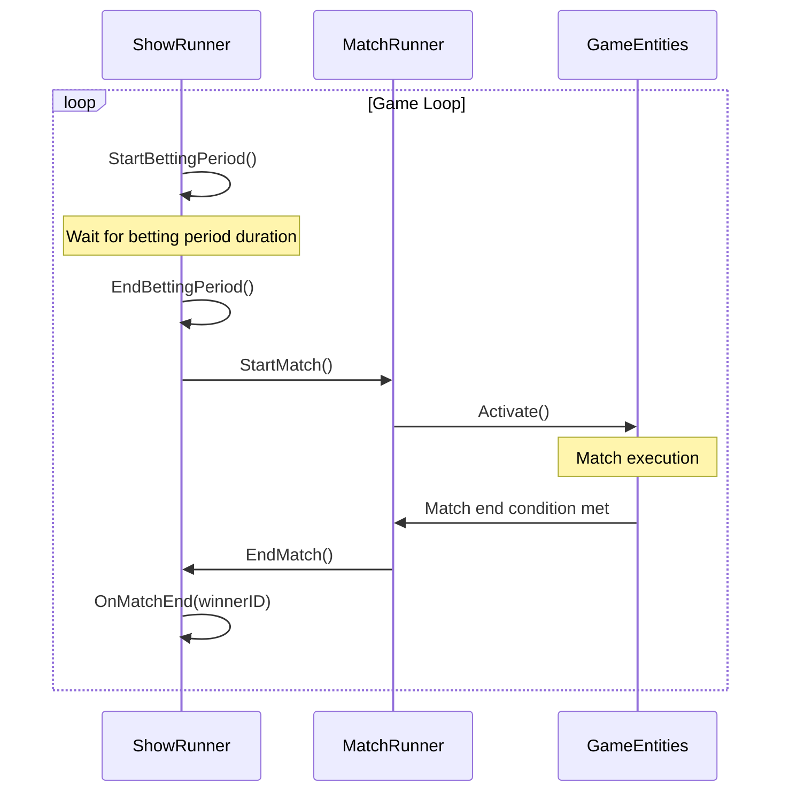

# NET-SLUM Technical Documentation

This document provides a detailed structural explanation of the NET-SLUM project for AI agents. It documents data structures, class relationships, and technical implementation details.

## Data Structures

### Competitor

```csharp
public class Competitor
{
    public const float MAX_LEVEL = 10f;
    public string id;
    public string name;
}
```

The base class representing a participant in a competition. Contains basic identification information.

### CompetitorStat

```csharp
public class CompetitorStat
{
    public string id;
    public string competitorID;
    public string competitorStatDefinitionID;
    public float value;
}
```

Represents a specific statistic or attribute for a competitor, such as strength, speed, health, etc.

### GameCompetitionInfo

```csharp
public class GameCompetitionInfo
{
    public List<GameCompetitionTeamData> competitionTeams;
    
    // Helper methods for accessing competitor data
    public Competitor? GetCompetitorData(string ID);
    public float GetCompetitorStatValue(string competitorID, string statDefinitionID, float defaultValue = -1f);
}
```

Contains information about all teams and competitors participating in a competition.

### GameCompetitionTeamData

```csharp
public class GameCompetitionTeamData
{
    public List<Competitor> competitors;
    public Dictionary<string, List<CompetitorStat>> competitorStats;
}
```

Represents a team in a competition, containing competitors and their associated stats.

### PayoutInfo

```csharp
public class PayoutInfo
{
    public uint WinnerID { get; set; }
}
```

Contains information about the winner for determining betting payouts.

## Core Classes

### MainController

```csharp
public class MainController: MonoBehaviour
{
    [SerializeField] private bool GoLive = false;
    [SerializeField] private enum Game { CombatArena, MapGame, Slapfight }
    [SerializeField] private Game InitialGame = Game.CombatArena;
    
    private ShowRunner _showRunner;

    private void Awake();
}
```

The entry point for the application, responsible for:
- Initializing the appropriate ShowRunner (Live or Mock)
- Setting the initial game type
- Persisting across scene loads (DontDestroyOnLoad)

### ShowRunner (Abstract)

```csharp
public class ShowRunner : MonoBehaviour
{
    protected MatchRunner _matchRunner;
    
    // Configuration for timing
    [SerializeField] private float _bettingPeriodDuration = 10f;
    [SerializeField] private float _postBettingStartDelaySeconds = 3f;
    [SerializeField] private float _postRoundStartBettingDelay = 3f;

    public bool BettingIsEnabled => _bettingEnabled;
    public float RemainingBetDuration => /*calculated*/;
    
    // Core methods
    public void SetGame(string gameName);
    protected virtual async Awaitable Initialize();
    protected async Awaitable LoadGame(string name);
    protected async Awaitable InitializeGame();
    protected async Awaitable InitializeMatch();
    protected virtual async Awaitable StartBettingPeriod();
    protected virtual async Awaitable EndBettingPeriod();
    protected virtual void StartRound();
    public virtual async Awaitable<GameCompetitionInfo> GetCompetitors();
    public virtual async Awaitable OnMatchEnd(int winnerID);
}
```

The base class that manages the overall flow of gameplay, including:
- Loading games as scenes
- Managing betting periods
- Initializing matches
- Handling the game loop

### LiveShowRunner

```csharp
public class LiveShowRunner : ShowRunner
{
    // Overrides base class methods to interface with network services
    protected override async Awaitable Initialize();
    protected override async Awaitable StartBettingPeriod();
    protected override async Awaitable EndBettingPeriod();
    public override async Awaitable<GameCompetitionInfo> GetCompetitors();
    public override async Awaitable OnMatchEnd(int winnerID);
}
```

A concrete implementation of ShowRunner that interfaces with live network services.

### MockShowRunner

```csharp
public class MockShowRunner : ShowRunner
{
    // Provides mock implementations for testing without network connectivity
}
```

A concrete implementation of ShowRunner that provides mock data and functionality for local testing.

### MatchRunner (Abstract)

```csharp
public class MatchRunner : MonoBehaviour
{
    protected ShowRunner _showRunnerRef;
    protected GameCompetitionInfo _competitorData;
    
    public virtual int MaxCompetitorCount { get; }
    protected virtual int WinnerID { get; }
    
    public virtual async Awaitable InitializeGameEnvironment(ShowRunner showRunner);
    public virtual async Awaitable InitializeMatchEnvironment();
    public virtual async Awaitable InitializeMatchCompetitors();
    public virtual void StartMatch();
    public virtual async Awaitable EndMatch();
}
```

The base class for game-specific match runners, responsible for:
- Setting up the game environment
- Initializing and managing match state
- Handling match start/end logic

### NetworkController (Static)

```csharp
public static class NetworkController
{
    private const string AuthorizationHeaderKey = "Cookie";
    private static string _sessionToken = "";
    
    private const string _productionRelayURL = "http://34.174.66.135:5000";
    private const string _developmentRelayURL = "http://localhost:5001";
    
    public struct ResponseData
    {
        public string Text;
        public string? Error;
        public Dictionary<string, string> Headers;
    }
    
    public static async Awaitable<ResponseData> POST(string controller, string endpoint, WWWForm body);
    public static async Awaitable<ResponseData> GET(string controller, string endpoint);
    public static void SetSessionToken(string token);
}
```

A static utility class for handling network communication with the backend service.

## Game-Specific Implementations

### CombatArena

#### CombatArenaMatchRunner

```csharp
public class CombatArenaMatchRunner: MatchRunner
{
    [SerializeField] private ArenaAgent _agentAPrefab;
    [SerializeField] private ArenaAgent _agentBPrefab;
    [SerializeField] private Transform _agent1SpawnPosition;
    [SerializeField] private Transform _agent2SpawnPosition;
    [SerializeField] private HealthBar _healthBarA;
    [SerializeField] private HealthBar _healthBarB;
    
    private ArenaAgent _agentA;
    private ArenaAgent _agentB;
    
    public UnityEvent OnRoundEnd;
    protected override int WinnerID => /*calculated*/;
    public override int MaxCompetitorCount => 2;
    
    public override async Awaitable InitializeMatchEnvironment();
    public override async Awaitable InitializeMatchCompetitors();
    public override void StartMatch();
    public override async Awaitable EndMatch();
}
```

A game-specific implementation of MatchRunner for the CombatArena game type.

#### ArenaAgent (Inferred)

Based on code references, this appears to be the base class for combat agents in the CombatArena game, with properties like:
- CurrentHP
- Methods for Initialize, Activate, Deactivate
- UnityEvents for damage and initialization

## Flow Diagrams

### Application Initialization Flow



### Game Loop Flow



## Directory Structure

```
NET-SLUM/
├── Scenes/
│   └── _BOOT/                  # Entry point scene
│       └── _BOOT.unity         # Main scene file
│
├── Scripts/
│   ├── Data/                   # Data structure definitions
│   │   ├── Competitor.cs       # Competitor data structures
│   │   └── Consts.cs           # Global constants
│   │
│   ├── ShowRunner/             # Game flow controllers
│   │   ├── ShowRunner.cs       # Abstract base class
│   │   ├── LiveShowRunner.cs   # Network implementation
│   │   └── MockShowRunner.cs   # Local testing implementation
│   │
│   ├── UI/                     # User interface components
│   │   └── ...
│   │
│   ├── Utility/                # Helper classes
│   │   └── CollisionHelper.cs  # Collision detection utilities
│   │
│   ├── MainController.cs       # Application entry point
│   ├── NetworkController.cs    # Network communication utilities
│   └── MatchRunner.cs          # Abstract match controller
│
├── Games/                      # Game-specific implementations
│   ├── CombatArena/            # Combat game implementation
│   │   ├── Scripts/            # Game-specific scripts
│   │   │   ├── CombatArenaMatchRunner.cs  # Game runner
│   │   │   ├── PopupText.cs               # UI effects
│   │   │   └── Agents/                    # Game agents
│   │   │
│   │   ├── Scenes/             # Game scenes
│   │   └── Prefabs/            # Game prefabs
│   │
│   ├── MapGame/                # Map-based game
│   │   └── ...
│   │
│   └── Slapfight/              # Slapfight game
│       └── ...
│
└── Packages/                   # Project dependencies
    └── packages.config         # NuGet package configuration
```

## Interface Requirements

When implementing new game types, the following interfaces must be adhered to:

### Required MatchRunner Methods

- `InitializeGameEnvironment(ShowRunner)`: Set up the game environment
- `InitializeMatchEnvironment()`: Prepare the match environment
- `InitializeMatchCompetitors()`: Set up competitors for the match
- `StartMatch()`: Begin match execution
- `EndMatch()`: Handle match completion

### Data Structure Constraints

- Competitors must implement the `Competitor` class
- Stats must follow the `CompetitorStat` structure
- Teams should be organized using `GameCompetitionTeamData`

## Network Protocol

### API Endpoints (Inferred)

Based on the NetworkController implementation, the API is structured as:
- Base URL: `http://{server}:{port}/api`
- Endpoints: `/{controller}/{endpoint}`
- Authentication: Session token passed in the "Cookie" header

### Authentication Flow

1. A session token is obtained (mechanism not clear in the code)
2. Token is stored via `NetworkController.SetSessionToken(token)`
3. Token is included in all subsequent requests

## Third-Party Dependencies

The project appears to use:
- NuGet packages (managed through packages.config)
- Unity standard packages (TextMesh Pro, etc.)
- Possibly a custom async/await implementation (Awaitable<T>)

## Integration Points

The project has several integration points with external systems:
- Network API for live game data
- Shared library ("bet-slum-shared lib") mentioned in comments 

## Audio System

### AudioManager

```csharp
public class AudioManager : MonoBehaviour
{
    // Singleton instance
    public static AudioManager Instance { get; }
    
    // Volume controls
    [SerializeField] private float _masterVolume;
    [SerializeField] private float _musicVolume;
    [SerializeField] private float _sfxVolume;
    
    // Core methods
    public AudioSource PlaySFX(AudioClip clip, float volume = 1f, float pitch = 1f, bool loop = false);
    public AudioSource PlaySFXAtPosition(AudioClip clip, Vector3 position, float volume = 1f, float pitch = 1f, float spatialBlend = 1f);
    public void PlayMusic(AudioClip clip, float fadeTime = 1f, float volume = 1f, bool loop = true);
    public void StopAllSFX();
    public void StopMusic(float fadeTime = 1f);
    
    // Volume controls
    public void SetMasterVolume(float volume);
    public void SetMusicVolume(float volume);
    public void SetSFXVolume(float volume);
}
```

A singleton manager class that handles all audio playback in the application. Features include:
- Audio source pooling for efficiency
- Separate handling of music and sound effects
- Crossfading between music tracks
- Volume control at multiple levels
- 3D spatial audio support

### AudioUtility

```csharp
public static class AudioUtility
{
    private static Dictionary<string, AudioClip> _clipCache;
    
    // Core methods
    public static AudioClip GetClip(string path);
    public static AudioSource PlaySFX(string path, float volume = 1f, float pitch = 1f);
    public static AudioSource PlaySFXAtPosition(string path, Vector3 position, float volume = 1f, float pitch = 1f);
    public static void PlayMusic(string path, float fadeTime = 1f, float volume = 1f);
    public static void ClearCache();
    
    // Utility methods
    public static float LinearToDecibel(float value);
    public static float DecibelToLinear(float dB);
}
```

A static utility class that provides helper methods for common audio operations:
- Loading and caching AudioClips from Resources
- Playing sounds directly from Resources paths
- Converting between linear and decibel volume scales
- Memory management through cache clearing 